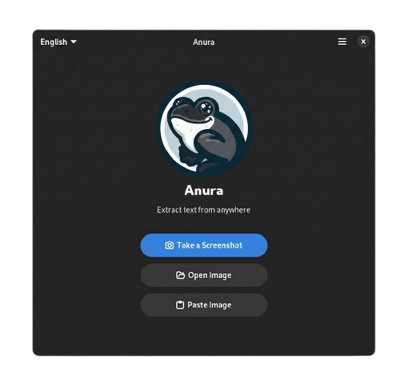

<div align="center">



<br/>

# Anura
Jumping from pixels to text in a single leap

**Intuitive text extraction for the Linux desktop.**  
OCR · QR Decoding · Privacy-first · Native GTK4

<br/>

[](https://github.com/D3M-Sudo/Anura/releases/latest)
[](LICENSE)
[](https://hosted.weblate.org/engage/anura/)
[](https://github.com/D3M-Sudo/Anura/releases/latest)

</div>

---

Anura lets you capture any region of your screen and instantly extract the text inside — from videos, screencasts, PDFs, webpages, or photos. The result lands straight in your clipboard, ready to paste.

It also decodes **QR codes** in a single click, with full system integration on modern GTK-based Linux desktops.

---

## Features

| | |
|---|---|
| 📷 **Instant OCR** | Select a screen region — text is copied automatically |
| 🔲 **QR Code Decoding** | Recognizes links and data from QR codes |
| 🌍 **Multi-language** | Supports 100+ Tesseract language models |
| 🔊 **Text-to-Speech** | Read extracted text aloud via gTTS |
| 🔒 **Privacy-first** | All processing happens locally — no data leaves your machine |
| 🎨 **Native GTK4** | Designed for GNOME, built with Libadwaita |

---

## Installation

### Flatpak — Stable Release

Download the `.flatpak` bundle from the [Releases](https://github.com/D3M-Sudo/Anura/releases/latest) page, then install:

```bash
flatpak install --user ~/Downloads/com.github.d3msudo.anura.flatpak
```

---

## Building from Source

### Prerequisites

| Tool | Version |
|------|---------|
| Meson | ≥ 1.5.0 |
| Python | ≥ 3.11 |
| GTK4 + Libadwaita | latest |
| Tesseract OCR | ≥ 5.0 |
| ZBar | any |
| Blueprint Compiler | ≥ 0.16.0 |

**Fedora:**
```bash
sudo dnf install meson python3-gobject gtk4-devel libadwaita-devel \
    tesseract zbar-devel blueprint-compiler
```

**Ubuntu / Linux Mint / Debian:**
```bash
sudo apt install meson python3-gi python3-gi-cairo gir1.2-gtk-4.0 \
    gir1.2-adw-1 tesseract-ocr libzbar0 blueprint-compiler
```

---

### GNOME Builder *(recommended)*

1. Install [GNOME Builder](https://wiki.gnome.org/Apps/Builder) from Flathub
2. Open the project folder in Builder
3. Press **Run (F5)** — Builder handles runtimes and compilation automatically

---

### Meson *(manual)*

```bash
git clone https://github.com/D3M-Sudo/Anura.git
cd Anura

meson setup builddir --prefix=/usr/local
ninja -C builddir

# Run without installing
./builddir/bin/anura

# Or install system-wide
sudo ninja -C builddir install
```

---

### Flatpak *(distributable bundle)*

```bash
flatpak-builder --force-clean build-flatpak \
    flatpak/com.github.d3msudo.anura.json
```

---

## Code Quality

Anura uses [Ruff](https://docs.astral.sh/ruff/) for linting and formatting, and [pytest](https://pytest.org) for testing.

```bash
# Activate the virtual environment first
source .venv/bin/activate

# Lint
ruff check anura/ build-aux/

# Format
ruff format anura/

# Auto-fix
ruff check --fix anura/

# Run tests (no GTK required)
pytest tests/ -m "not gtk" -v

# Run GTK-dependent tests (requires setup)
mkdir -p builddir
cp data/com.github.d3msudo.anura.gschema.xml builddir/
glib-compile-schemas builddir/
export GSETTINGS_SCHEMA_DIR="builddir"
pytest tests/test_clipboard_service.py tests/test_tts_service.py -v
```

> **Note:** Tests marked `@pytest.mark.gtk` require system GTK libraries and GSettings schema.  
> See `.windsurf/rules/testing.md` for complete setup instructions.

---

## Localization

Anura is translated via [Weblate](https://hosted.weblate.org/engage/anura/). Contributions in any language are welcome.

[](https://hosted.weblate.org/engage/anura/)

**For maintainers** — after changing translatable strings, from the `po/` directory:

```bash
# Update the POT file and POTFILES
bash update_potfiles.sh

# Sync all locale files before committing
for f in *.po; do msgmerge -U "$f" anura.pot --backup=none; done
```

Then push `anura.pot`, `POTFILES`, and the updated `.po` files to keep Weblate in sync.

---

## Contributing

Any help is appreciated — bug reports, translations, code, or design feedback.

Anura follows the GNOME project [Code of Conduct](https://gitlab.gnome.org/World/amberol/-/blob/main/code-of-conduct.md).  
See [CONTRIBUTING.md](CONTRIBUTING.md) for development guidelines and workflow details.

---

## License

Released under the **MIT** license. See [`LICENSE`](LICENSE) for details.

---

<div align="center">

*Fork of [Frog](https://github.com/freehck/frog) by Andrey Maksimov — adapted and maintained for the Anura ecosystem.*

</div>
